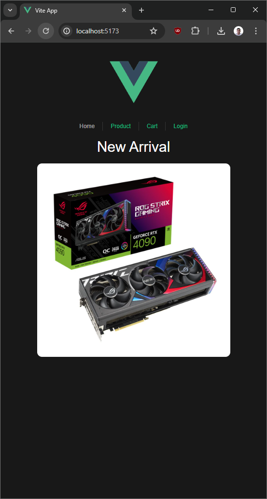
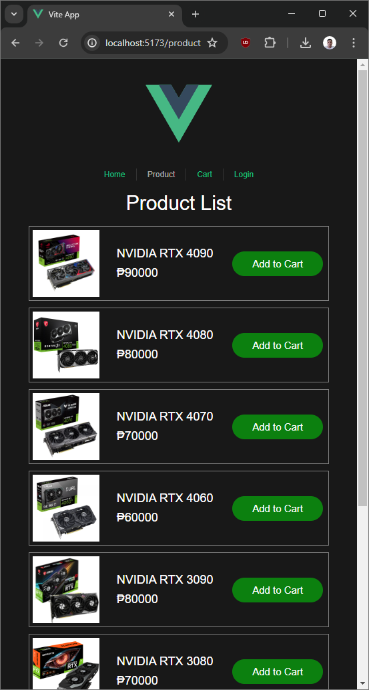

# **Interactive Shopping Cart in Vue.js**

## Table of Contents


- [Objectives](#objectives)
- [Scenario](#scenario)
- [Technical Requirements](#technical-requirements)
- [Interactivity](#interactivity)
- [Assessment](#assessment)
- [Project Setup](#project-setup)
- [Screenshots](#screenshots)

## **Objectives:**

-   Demonstrate understanding of Vue data binding, interpolation, methods, and computed properties.
-   Implement interactive features like adding/removing items, updating quantities, and calculating totals.
-   Utilize Vue components for modularity and reusability.

## **Scenario:**

Build an interactive shopping cart application using Vue.js. The application should allow users to:

-   Browse a list of products with names and prices.
-   Add items to the cart by clicking an "Add to Cart" button.
-   Update the quantity of items in the cart.
-   Remove items from the cart.
-   See the total price of all items in the cart.

## **Technical Requirements:**

-   Use Vue.js for component-based development.
-   Implement data binding to dynamically update product listings, cart contents, and totals.
-   Utilize interpolation to display product information and cart details.
-   Define methods for handling user interactions like adding/removing items and updating quantities.
-   Calculate the total price as a computed property based on cart items and prices.
-   Use Vue components for product listings, cart items, and other reusable elements.

## **Interactivity:**

-   Users should be able to add, remove, and update items in the cart seamlessly.
-   Changes in quantity should instantly reflect in the total price.
-   The application should provide clear visual feedback for user actions.

## **Assessment:**

-   Evaluate the student's code for proper use of Vue data binding, interpolation, methods, and computed properties.
-   Assess the application's functionality, interactivity, and user-friendliness.
-   Review the code for clarity, readability, and adherence to Vue best practices.


## Project Setup

### Clone the project in desired project folder

```sh
git clone https://github.com/vncnthgy/vue-cart.git
```

### Install the project dependencies

```sh
npm install
```

### Go to the project folder and run

```sh
npm run dev
```

## Screenshots






